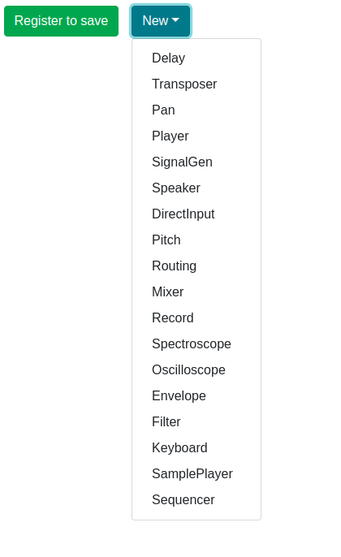
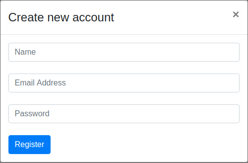
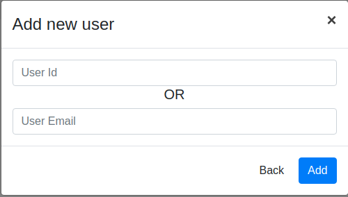
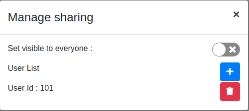

# Front-end
In this document we will go through all the components and files residing in the frontend folder.  
Frontend folder has following files & folders on the root directory

1. package.json
2. package-lock.json
3. webpack.config.js
4. node_modules
5. public
6. src

## Let's go through them one by one 
1. `package.json`: The package.json file is the heart of Node.js system. It is the manifest file of any Node.js project and contains the metadata of the project.  
Currently our project have two custom scripts `webpack` and `build`.`webpack` script starts the webpack in `watch mode` using configuration from `webpack.config.js` whereas `build` will simply run the `webpack` once.  
Wanna know what webpack is? [Click Me](https://webpack.js.org/)

2. `package-lock.json`: It has the record of each installed package which allows you to re-install them. Only delete this file in case of emergency.

3. `webpack.config.js`: It hold the configuration that is to be used by `webpack`.  
Wanna know what webpack is? [Click Me](https://webpack.js.org/)  
Currently the configuration is set to do following three operation.
    - Clean the public folder in the backend directory
    - Copy all files residing in public folder of frontend to public folder of backend
    - build the react project and move it a build directory inside public folder of backend  

4. `node_modules`: node_modules is where npm modules are saved. If you open node_modules , you should see a folder named react , which contains the code that makes React run.

5. `public`: You will found `assets` folder and `index.html` file in this directory.  
    - `assets`: Responsible for containing all assets imported in `index.html` file
    - `index.html`: As we know react is actually a Single-Page Application and this is the file which is loaded and as a user interact other components are loaded without refreshing a page

6. `src`: This is the folder where the whole source code of our project resides whether it is component, service or a worker.  
It has a folder `component` and two files `index.js` and `index.css` at root level.
    - `component`: It has all the configuration and source code of various components
    - `index.js`: A src level `index.js` is the initial place in a React-based application where you tell React to physically mount the App Component to the actual HTML DOM, on a container element, something like this and say that 'root' is an ID of an element already on the page before your JavaScript loads.
    - `index.css`: Conatins css rules which are being imported in `index.js`.

### src/components
As we already discussed it's resposible for holding major part of our source code. 
It has component as folders along with following files file.  

 - `action.js`: This file contains all the api call methods used in `index.js` at current level.

 - `api.js`: This file contains all the functions that you will ever need to make api calls. Every method in it is self-explanatory, we are sending a token which we got from redux store along with every api call for validation.

 - `common.js`: This file contains all the common methods which are being used through the project.  
 Currently it has 4 methods
    - `isUserLoggedIn`: return user `token` value if user user is logged in or else return `undefined`
    - `successErrorHandler`: you can pass an error object to this method to show a error toast.
    - `showToastrError`:  you can pass an message along with type to this method to show a toast message.
    -  `getHeaders`: It takes `token` value as input and return with a header object

- `constants.js`: You can add all constants that you want to use throughout the project in this file.

- `index.js`: This file serve as the entry point for all other component and it's where we attach the router with our main app.

- `main.js`: This file contains css rules which are imported in `index.js` at current level.

- `router.js`: In single page apps, there is only single html page.we are reusing the same html page to render the different components based on the navigation and this file use `react-router-dom` to handle navigation in our current app.

- `store.js`: This file provides us with a const `store` in which we can store various values that we don't want to loose while moving between components.

Now we will move to the components and how they works

Every component folder follow the same pattern and splitted in various files with reusability in mind.Mostly you will encounter with two files `index.js` and `actions.jsx`.`index.jsx` is a entry point to that specific component and `actions.jsx` have the api calls method which are being used in that particular component.  

Now, as we are done with the basic information we will go through the components one by one.

1. `about`: It's a simple static page.

2. `addSound`: 

3. `contact`: It's a simple static page.  

4. `form`: This folder consist of various self-explanatory custom made advance form inpust component which can be directly used throught the project

5. `header`:

6. `home`:  It's a simple static page.

7. `login`:  

8. `projectEditor`:  

9. `projects`:

10. `register`:

11. `sounds`:

