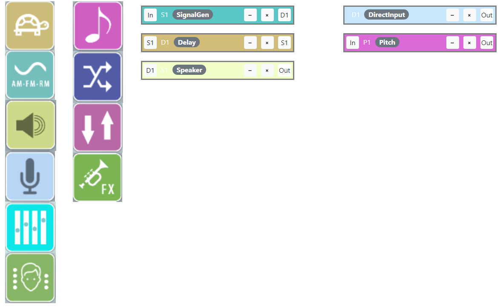
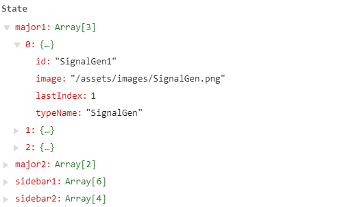

# General Developer Documentation

This file includes documentation for *developers*. Major sections include:
- Documentation for the UI, including Soundcool components
- Documentation for Audio Processing in Soundcool components

See also [design.md](design.md) for design and architectural notes.

## Documentation for the UI

For the UI, we use React style of Single Page Application in which different components are rendered.

The UI of the soundcool application is expected to have an initial login page and an option to Sign-up. 
Once a user logs in, he can navigate across various components such as
- AboutUs Page 
- ContactUs Page  
- SoundMenu Page  
- Project Page  

The driver of this code is the MainComponent which calls the other components and makes use of Routing to render different components based on the path. Here we have  `<Switch> ... </Switch>` which decides which of the component is rendered similar, to switch statements in other programming languages (like C++). Once the path matches, the component requested is rendered. Functions can also be passed as props here as shown in Fig 1.

|  |
|:--:| 
|Fig 1: Routing code from MainComponent.|

Many of the components such as the Header, Footer, AboutUs, Home and Contact Component are pretty self-explanatory as they just include bootstrap styling.

### LoginComponent
LoginComponent renders a login form and makes use of the `<RegisterForm>` Component declared in the file ‘LoginComponent.js’ if a user has not signedUp yet. Once the user registers, an action must be dispatched that adds the user credentials to the store which will later be used for verification purposes. The credentials must include username, email and password. The backend of the registration and verification are yet to be implemented and more credentials may be asked for in future based on use case. For now, just the three should do. The email can be used to reset the password.

### SoundComponent
The user has the option to add sounds to his media files that can be later accessed by the sound components in the project later. The purpose of this page is to allow the users to add media to their account.  The sound files are added by dispatching an action which stores the information of the new media in the store itself.

### ProjectComponent:

This is the editing Component in the soundcool application. It is where a user will configure processing modules and interconnect them to create a project. 

#### What exactly is a project? 

A project consists of module instances, parameter settings, and interconnections. The project also includes the visual layout of these modules when displayed in the ProjectComponent. The ProjectComponent allows the user to create module instances by dragging icons from the 2 sidebars  into one of the 2 center columns as shown in Fig 2. 

|  |
|:--:| 
|Fig 2: The ProjectComponent display showing icons at left and module instances in the two columns to the right.|

Let us call the each module in the center a “block”. So essentially, a project is just two lists of blocks. Within the code, blocks are represented as an object and the lists are an array of these objects. Moving the objects and reordering them just requires splicing of arrays and manipulating them. We make use of the move and reorder functions to assist us in implementing module moving and reordering within and between lists. 

#### What happens when a module is dropped from the sidebar to the center?

When dragging an icon is completed, the onDragEnd function is triggered. This implements  application behavior on completion of a drag. For example, if a block is dragged to the sidebar, nothing should happen. Details are in this function.
Once a module is dropped to the center, we need to just add an object to one of the two lists. This is done in 2 steps. 

The addBlock function is an Action in redux which adds the information of the block to a blockList that is present in the redux store. The blockList is a single list of all the blocks that are present in the current project. Each Block is assigned an ID when being stored in the store.

The ProjectComponent is a stateful component i.e it stores information as shown in Fig 3. Everytime we add, move, or reorder a block, we alter these 4 arrays. (FIXME:) Note that the array does not store any information about the object but that required for its identification only. The details regarding its properties such as the frequency for a SignalGen block is stored in the redux Store. The state here just stores a reference to that block in the store.

|  |
|:--:| 
|Fig 3: ProjectComponent state|

#### What is an Action and store in redux?

An action is just a function. In redux terminology, we use functions to alter the redux store. A redux store holds the whole state of the application. Broadly speaking, a redux store contains data in a global variable that can be accessed throughout the React Application. The technical details on how to handle it are well documented in their official documentation here. (FIXME)     

#### How do we delete a block from the project?
Block deletion is implemented in the handleDelete function. This function identifies the list from which the object is removed and updates the state of the list accordingly. An action is also dispatched that removes the block from the redux store. 

The following keywords will be useful to understand the code better. However, this might not be required.
- `<DragDropContext />` - Wraps the part of your application you want to have drag and drop enabled for.
- `<Droppable />` - An area that can be dropped into. Contains multiple `<Draggable />`.
- `<Draggable />` - What can be dragged around
- `Innerref`- Our `<Draggable />` and `<Droppable />` components both require a HTMLElement to be provided to them. This is done using the innerRef property on the `DraggableProvided` and `DroppableProvided` objects.

The projectComponent has been kept separate from the rest of the UI as the design for the remaining UI has not been finalized and is open to alterations. 

## Audio Components

The code in `/src/audio/` defines classes built on top of Web Audio that will be instantiated by the soundcool user interface to synthesize sound.

### Implementing a module
ScModule definition requires the following:
* A JavaScript class inherited from `ScModule` (defined in `sc-module.js`) if it has a direct mapping to soundcool module (DIRECT INPUT, PLAYER, for example). For instance:
```js
import ScModule from './sc-module.js';

class ScDelay extends ScModule { ... 
```
Inheriting allows us to reuse generic attributes and methods (like `connectTo`). There are some helper classes like `ScOscillator` and `ScAnalyzer` that do not inherit ScModule but are used by other higher level classes.
* Implement a `constructor` with the following signature:
```js
    constructor(context, options={}){
        super(context);
        ...
    }
```
Constructor should take `context` as the input argument so that all modules share the same Web Audio's `AudioContext` passed during instantiation. The other argument should be `options` to override the default options for that module. This will be called when user drags a module by hand in the project. Inside the constructor, firstly call ScModule's constructor to initialize generic class attributes. Initialize all Web Audio nodes using the passed context and connect them. The Web Audio node that should act as input to this ScModule should be referenced as `this.inNode` and the output as `this.outNode`. Below for example, we have ScPan's implementation:
```js
    setupNodes() {
        this.inNode = this.outNode = this.context.createStereoPanner();
        this.pan = this.options.panVal;
    }
```

* All the parameters that can be controlled for a ScModule is stored in the `options` attribute for that class. This is a JS object refered as `this.options`. The idea is to have it serializable so that a audio synthesis pipeline can be dumped and restored. Each option that a class understands should have a reasonable default value that is set in the constructor if not passed in `options` explicitly. For example `delayTime` and `feedback` are two options supported by ScDelay:
```js
class ScDelay extends ScModule {

    constructor(context, options={}) {
        super(context);
        let defOpts = {'delayTime':0.1, 'feedback':0.3};
        this.options = Object.assign(defOpts, options);
    }
    ...
```
* Define a setter for each ScModule option that can be tweaked from user interface.  It should change the value for the option in the `options` and actually set the value of Web Audio node parameter. Following setter for example sets `delayFeedback` in `ScDelay`:
```js
    set delayFeedback(val) {
        this.options.feedback = val;
        this.delayGain.gain.value = val;
    }
```

* Define `destroy` to disconnect all the Web Audio nodes and remove audio node from the audio context. This method will be called when user removes a module from the project (this is WIP for existing modules).


### Notes / Conventions
* There is no need to implement `connectTo` / `disconnect` method for classes inherited from `ScModule`. `ScModule` implementation is generic for all modules that it inherits.

* The convention adopted for file naming is `sc-{}.js` that defines a class `Sc{}` (camel cased) for a given soundcool module (where `{}` is a placeholder for a soundcool module). For example: `sc-pan.js` defines `ScPan`; `sc-player.js` defines `ScPlayer`.

* Most ScModules have `setupNodes` method for spinning up the Web Audio nodes and connect them. Every ScModule should have an `inNode` and `outNode` that will be used to `connectTo` any two instantiated ScModule objects (refer to ScModule's `connectTo` method).

* Some input sources like `ScDirectIn` and `ScPlayer` are asynchronous. ScDirectIn waits for user permissions; ScPlayer makes an HTTP request to load audio. To handle this async events, these classes resolve a promise refered as `connPromise` when it is ready for connections. Following example shows how to chain a `ScDirectIn` to `ScSpeaker` object if/when granted the permission from browser:
```js
let mic = new ScDirectIn(scContext);
let speakers = new ScSpeakers(scContext);
mic.connPromise.then(function(){
    mic.connectTo(speakers)
})
```
